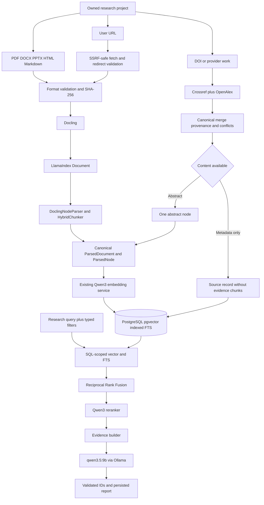

# Advanced RAG Implementation Status

Last updated: 2026-10-03
Working branch: `feature/advanced-rag-upgrade`
Current migration head: `0013_multi_source_ingestion`

This is the handoff record for the advanced research assistant. It describes
the implemented repository rather than a proposed replacement architecture.

## Current architecture



Responsibility remains separated:

| Component | Responsibility |
| --- | --- |
| Docling | Understand file layout, sections, slides, pages, and tables |
| LlamaIndex | Standardize Documents and Nodes and run Docling-aware chunking |
| Secure URL fetcher | Validate user URLs, DNS/IPs, redirects, types, time, and size |
| Crossref/OpenAlex | Supply scholarly metadata; they do not download papers |
| Canonical domain layer | Normalize sources, metadata, provenance, and conflicts |
| Qwen embedding | Create 1024-dimensional semantic vectors |
| PostgreSQL | Own source records, nodes, pgvector, FTS, and filter execution |
| RRF/Qwen reranker | Rank evidence from the two retrieval branches |
| Ollama | Generate only from selected evidence |

No LlamaIndex vector store, additional vector database, LangGraph, Ragas,
Redis, or Celery has been introduced.

## Source ingestion flows

### File

```text
Owned project
→ extension/MIME/signature/archive/text validation
→ HTML active-content removal where applicable
→ one-pass local storage and SHA-256
→ project duplicate check
→ Docling rich JSON
→ LlamaIndex Document and Nodes
→ canonical normalization
→ batched Qwen embeddings
→ Document/DocumentChunk persistence
```

PDF, DOCX, PPTX, HTML, and Markdown are exposed. PPTX slide provenance is
stored as `slide_start`/`slide_end` and `location_kind=slide`; it is not
presented as PDF page provenance. HTML scripts, frames, forms, embedded active
objects, event attributes, and unsafe links are removed before parsing.
Markdown is parsed as document content and is never executed in a browser.

CSV and XLSX remain deferred. Docling can parse them, but the application does
not yet have explicit row/sheet bounds and tested table-node policies. They are
therefore not exposed merely because the library recognizes them.

### URL

```text
Owned project
→ scheme validation
→ DNS resolution and all-address public-IP check
→ bounded HTTP request without automatic redirects
→ validate every redirect destination
→ Content-Type and byte-limit enforcement
→ PDF signature or UTF-8 HTML validation
→ permanent validated local source storage
→ SHA-256 duplicate check
→ existing Docling/LlamaIndex/Qwen pipeline
```

Only HTTP and HTTPS are accepted. Initial URL and every redirect are checked
against loopback, private, link-local, multicast, unspecified, reserved, and
other non-global IPv4/IPv6 ranges. Credentials in URLs are rejected. Downloads
are streamed under explicit connect/read timeout, redirect, and decompressed
byte limits. Accepted remote types are `text/html`, `application/xhtml+xml`,
and `application/pdf`. Executables, archives, and unknown binary content are
rejected.

Fetched content is intentionally promoted into validated local document
storage because the current Document source of truth requires a stored file.
Failed validation and duplicate downloads are deleted. Successfully stored
sources remain available for re-ingestion and user review.

### DOI and scholarly providers

```text
DOI
→ conservative normalization
→ same-project DOI duplicate lookup
→ one exact Crossref lookup plus one exact OpenAlex lookup
→ provider-neutral adapters
→ deterministic merge
→ field provenance plus recorded conflicts
→ ABSTRACT or METADATA_ONLY source
```

Accepted DOI forms include a bare DOI, `doi:` prefix, and `doi.org` or
`dx.doi.org` URL. Arbitrary URLs are not treated as DOI values.

Crossref uses `GET /works/{encoded-doi}` with HTTPS, an identified User-Agent,
and `mailto` when configured. OpenAlex uses a singleton Work lookup with DOI or
Work ID, requests selected fields only, and sends `OPENALEX_API_KEY` as the
current `api_key` parameter when configured. Crossref 404 does not invalidate
OpenAlex, and OpenAlex failure does not invalidate Crossref.

Both clients use explicit timeouts and bounded retries for 429/5xx/timeouts.
`Retry-After` is honored within a two-second per-retry cap. 400/401/403/404 are
not blindly retried. A DOI is resolved, partially resolved, unresolved,
provider unavailable, or conflicting. Provider payloads are adapted to the
`ScholarlyWorkMetadata` contract and do not leak through application APIs.

OpenAlex OA/location metadata is recorded but never used to automatically
download an external paper. Full-text acquisition remains a separate future
capability requiring explicit access and licensing rules.

## External source semantics

| Content level | Meaning | Evidence behavior |
| --- | --- | --- |
| `user_document` | User uploaded the actual local file | Structured nodes may support claims |
| `full_text` | A complete remote document, currently a fetched PDF | Structured nodes may support claims |
| `web_page` | Parsed research webpage | Nodes are identified as webpage evidence |
| `abstract` | Provider supplied a real abstract | Exactly one abstract node, clearly labelled |
| `metadata_only` | Bibliographic metadata without abstract/body | Listed and filterable; creates no evidence chunks |

The content level propagates through persisted nodes, retrieval candidates,
reranking, evidence, citations, generation prompts, APIs, and frontend cards.
The prompt explicitly prevents metadata-only context from supporting detailed
scientific claims and asks the model to distinguish abstract evidence.

## Scholarly metadata merge

Canonical fields include DOI, title, authors, abstract, publication year/date,
journal, publisher, OpenAlex/Crossref IDs, landing URL, and OA status.

The deterministic selection rule is an implementation choice rather than a
claim that one provider is universally correct:

- Crossref-deposited values are selected first for ordinary bibliographic
  fields when available.
- OpenAlex fills missing fields and is selected first for OpenAlex ID and OA
  status.
- Every selected field records `crossref` or `openalex` provenance.
- When both non-null values differ, a compact conflict object retains both.
- Crossref JATS/HTML abstracts are converted to text without executing markup.
- OpenAlex inverted-index abstracts are reconstructed in positional order.

The same DOI may exist for different users or projects. Within one exact
user/project scope, a duplicate DOI is rejected before external API calls.

## API

Existing upload and research APIs remain compatible. New owned project routes:

```text
POST /api/v1/projects/{project_id}/sources/url
POST /api/v1/projects/{project_id}/sources/doi
POST /api/v1/projects/{project_id}/sources/openalex
POST /api/v1/projects/{project_id}/sources/crossref
GET  /api/v1/projects/{project_id}/sources
```

Archived or foreign projects are rejected by the existing ownership lookup.
Source listing returns source type, content level, title, authors, DOI, year,
source URL, parser/ingestion data, status, and chunk count without returning
provider keys or local filesystem paths.

Duplicate file/URL content is determined by SHA-256 within exact user/project
scope. Duplicate scholarly sources use normalized DOI in the same scope. Both
return HTTP 409 without re-running expensive ingestion or provider requests.

## Retrieval filters

`RetrievalFilters` provides validated optional filters for:

- Document IDs
- Source types
- Content levels
- Publication year range
- Normalized DOI

Every filter is added to both PostgreSQL vector and FTS SQL before ordering and
top-K limiting. RRF and the Qwen reranker remain unchanged. Author filtering is
deferred because authors are currently a JSON array; unreliable substring
matching has not been presented as structured author search.

## Database

Migration `0013_multi_source_ingestion`:

- Expands the migration-friendly `document_type` check constraint with `pptx`,
  `html`, `markdown`, and `metadata`.
- Adds `(user_id, project_id, source_type)`.
- Adds `(user_id, project_id, content_level)`.
- Adds `(user_id, project_id, publication_year)`.
- Adds `(user_id, project_id, doi)`.

SQLite migration logic explicitly preserves and restores child chunks while
the parent Document table is recreated. Downgrade refuses to discard format
meaning while any Phase 3 format rows exist. Empty `0012 → 0013 → 0012 → 0013`
and legacy-row upgrades have been verified. PostgreSQL offline SQL has been
generated and inspected.

## Configuration

New settings used by this phase:

```text
URL_FETCH_TIMEOUT
URL_CONNECT_TIMEOUT
URL_MAX_BYTES
URL_MAX_REDIRECTS
CROSSREF_BASE_URL
CROSSREF_MAILTO
CROSSREF_USER_AGENT
CROSSREF_TIMEOUT
OPENALEX_BASE_URL
OPENALEX_API_KEY
OPENALEX_TIMEOUT
PROVIDER_MAX_RETRIES
```

No secret has a checked-in value. OpenAlex casual calls can work without a key,
while a key is recommended for normal use and higher limits.

## Frontend

The existing Sources/Documents page now loads owned projects and supports:

- File, URL, and DOI tabs in one compact source dialog.
- Project selection before adding external sources.
- PDF, DOCX, PPTX, HTML, and Markdown upload validation.
- Source type and content-level labels on every source row.
- Year, authors, DOI, status, page/chunk details, and metadata-only distinction.
- Server-provided safe error messages for unsafe URLs, unsupported content,
  limits, duplicate sources, unresolved DOI, rate limits, and provider outage.

## Testing and external services

Normal tests generate tiny deterministic PPTX/DOCX/PDF fixtures and inline
HTML/Markdown. Network responses, DNS, Crossref, and OpenAlex are mocked.
Normal tests never require provider keys, Ollama, Qwen downloads, or internet.

Opt-in tests:

- Real Docling PDF: `RUN_DOCLING_INTEGRATION_TESTS=1`.
- Live Crossref/OpenAlex: `RUN_PROVIDER_LIVE_TESTS=1`.
- Destructive PostgreSQL: `POSTGRES_TEST_DATABASE_URL` pointing only to a
  disposable database whose name includes `test`.

`docker-compose.test.yml` provides a local temporary pgvector/PostgreSQL 16
service. The suite will not use shared Supabase for destructive migrations.

Verification on 2026-10-03:

| Check | Result |
| --- | --- |
| Backend suite | 128 passed, 3 skipped, 0 failed |
| Frontend Vitest | 9 passed across 3 files |
| Real Docling DOCX plus PPTX/HTML/Markdown fixtures | 2 passed; the second test covers all three new formats |
| Opt-in real Docling PDF | 1 passed |
| PostgreSQL/pgvector integration | 1 skipped because `POSTGRES_TEST_DATABASE_URL` and local Docker were unavailable |
| Live Crossref/OpenAlex | 1 skipped by default; `RUN_PROVIDER_LIVE_TESTS` was not enabled |
| TypeScript | Passed |
| ESLint | Passed |
| Frontend production build | Passed |
| Python compile and dependency check | Passed |
| Alembic | Empty database to head, 0012 to head, and 0013 round trip passed on SQLite |

The three skips in the complete backend run are the explicitly opt-in real
Docling PDF, PostgreSQL, and live provider checks. The real Docling PDF test was
then enabled and passed separately. PostgreSQL was not claimed as executed;
the checked-in disposable service and test remain ready for an environment
with Docker or a dedicated test database.

## Known limitations

- Ingestion and research remain synchronous.
- Successfully fetched URLs are stored on local disk; remote object storage is
  outside this phase.
- DNS and redirect targets are validated before each request. HTTPX still owns
  the final connection resolution, so deployments should also enforce outbound
  network policy for defense in depth.
- URL HTML and PDFs are supported; remote DOCX/PPTX are not yet accepted.
- CSV/XLSX are deferred pending bounded sheet/row chunk semantics.
- Metadata-only sources are filterable/listed but do not participate in semantic
  evidence retrieval because they intentionally have no chunks.
- Citation coverage, database ownership revalidation, semantic entailment, and
  bounded repair remain incomplete.

## Next phase

The next slice is intentionally limited to:

```text
typed evidence contract
+ strict structured Pydantic generation
+ citation coverage and ownership validation
+ bounded citation repair
```

LangGraph and Ragas remain later work after those contracts are stable.
