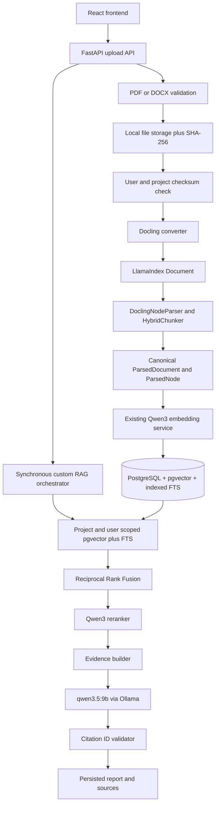

# Advanced RAG Implementation Status

Last updated: 2026-10-04
Working branch: `feature/advanced-rag-upgrade`

This document is the handoff record for the advanced research assistant upgrade.
It describes the repository as implemented and must be updated when a phase
changes the architecture, database, API, model configuration, or test status.

## Current architecture

The application is a React/Vite frontend backed by FastAPI. SQLAlchemy and
Alembic manage SQLite for ordinary tests and PostgreSQL with pgvector for real
indexing and retrieval. The ingestion boundary now uses Docling to understand
files and LlamaIndex to standardize Documents and Nodes. Application domain
models separate those framework objects from persistence and retrieval.

LlamaIndex does not create or own a vector index. Once nodes are persisted,
retrieval works entirely from the application's PostgreSQL tables.

### Implemented upload flow

1. An authenticated user uploads a PDF or DOCX, optionally into an owned,
   non-archived project.
2. Storage validates the filename, extension, MIME type, size, and format
   signature. DOCX ZIP contents are also checked for traversal, encryption,
   macros, excessive members, and excessive expanded size.
3. The file is stored under `backend/data/uploads`; SHA-256 is calculated in
   the same write pass.
4. The service checks `user_id + exact project_id + checksum`. A duplicate is
   deleted from temporary storage and rejected with HTTP 409 and code
   `duplicate_document`, so parsing and embedding do not run again.
5. A new Document is committed as `UPLOADED`, then moved to `PROCESSING`.
6. By default, Docling produces a rich JSON LlamaIndex Document. The official
   Docling node parser and hybrid chunker produce token-aware Nodes using the
   Qwen embedding tokenizer and Markdown table serialization.
7. A framework-neutral adapter normalizes the document and nodes into
   `CanonicalMetadata`, `ParsedDocument`, and `ParsedNode` contracts.
8. The existing Qwen embedding service embeds every node in one batch.
9. Canonical metadata, node metadata, and embeddings are persisted in one final
   commit that changes the status to `INDEXED`.
10. If parsing, embedding, or persistence fails, the transaction is rolled
    back, partial chunks are cleared, the Document is marked `FAILED`, and a
    short sanitized error is saved. Full exception details remain in logs.

### Implemented research flow

1. Research queries constrain both vector and full-text branches by the
   authenticated user and, when supplied, the owned project.
2. Reciprocal Rank Fusion combines the two result lists.
3. The Qwen reranker orders candidates and the evidence builder selects the
   bounded context.
4. Ollama generates from that evidence when it is sufficient; otherwise the
   fixed insufficient-evidence response is returned.
5. Known citation IDs are mapped to supplied evidence and unknown IDs are
   removed before the report is saved.

## Responsibility boundaries

| Component | Responsibility |
| --- | --- |
| Docling | File parsing, layout, pages, headings, tables, and configured OCR |
| LlamaIndex | Document and Node abstractions, metadata propagation, and Docling-aware node parsing |
| Canonical domain layer | Stable framework-neutral parsed document, node, and metadata contracts |
| Qwen3 embedding | Normalized 1024-dimensional semantic vectors |
| SQLAlchemy/PostgreSQL | Source of truth for documents, nodes, vectors, and FTS |
| Custom retrieval | pgvector, PostgreSQL FTS, RRF, Qwen reranking, and evidence selection |
| Ollama | Local answer generation from selected evidence |

## Canonical metadata

`SourceType` currently defines `uploaded_file`, `web_page`, `doi`, `openalex`,
and `crossref`. Only `uploaded_file` is ingested in this phase; the other values
establish a shared future source contract.

`ContentLevel` defines `full_text`, `abstract`, `metadata_only`, `web_page`, and
`user_document`. Uploaded PDF and DOCX files use `user_document`, meaning the
user supplied the document body. This prevents future abstract-only sources
from being represented as full papers.

Document metadata has dedicated fields for frequently queried values and JSON
for flexible values. `metadata_provenance` maps each populated metadata key to
one of `user`, `extracted`, `docling`, `openalex`, `crossref`, or `publisher`.
Missing title, author, abstract, DOI, publication date, and external IDs remain
null; the pipeline does not fabricate them.

Document-level metadata includes source URI/URL, checksum, title, authors,
abstract, DOI, external IDs, publication details, content level, parser name
and version, and ingestion version. Node-level metadata includes stable node
ID, nullable page range, section and section path, token count, content kind,
Docling labels/references, captions, and compact traceability fields. It does
not duplicate the complete document metadata blob on every node.

## Page, section, and table preservation

- PDF provenance is represented as a nullable inclusive page range. A hybrid
  chunk may span multiple pages, such as `page=1` and `page_end=2`.
- DOCX nodes correctly keep page values null when the format has no reliable
  page concept. Page numbers are never invented during ingestion.
- Docling headings become section paths; the final heading is also stored as
  the node section.
- Tables use Docling's Markdown table serializer. Table labels, captions,
  references, section, page provenance, and document identity remain attached
  to the retrievable node.

## Completed components

| Area | Current implementation | Status |
| --- | --- | --- |
| Backend | FastAPI, versioned API, shared errors, and CORS | Complete baseline |
| Authentication | Password accounts, Google OAuth, revocable cookie sessions, and ownership checks | Complete baseline |
| Projects | Private CRUD, project-linked documents/runs, soft archive, and ownership isolation | Complete |
| Database | SQLAlchemy 2, Alembic, SQLite test compatibility, and PostgreSQL | Complete baseline |
| Canonical sources | Source type, content level, flexible metadata, and field-level provenance | Implemented |
| Upload security | PDF and DOCX dispatch, signatures, bounded ZIP checks, macro rejection, and maximum size | Implemented for exposed formats |
| Checksum/deduplication | Single-pass SHA-256 and same-user/same-project duplicate rejection | Implemented |
| Structured ingestion | Official Docling Reader, LlamaIndex Document, DoclingNodeParser, and HybridChunker | Implemented |
| Legacy ingestion | Controlled pypdf and character-chunk adapter | Retained as explicit fallback |
| Embeddings | Existing cached/batched Qwen3 embedding service | Reused unchanged |
| Retrieval | Project/user-scoped pgvector plus indexed PostgreSQL FTS | Complete baseline |
| Ranking | Stable RRF and cached Qwen3 reranker | Complete baseline |
| Evidence/citations | Rich node provenance propagated through evidence; citation ID allowlist validation | Partial citation baseline |
| Generation | Local Ollama generation with timeout and grounded prompt | Working baseline |
| Frontend | Auth, compatibility PDF/DOCX upload, research, progress, reports, and project-aware API types | Working baseline; project selection UI is deferred |

## Supported formats

| Category | Formats |
| --- | --- |
| Implemented and exposed | PDF, DOCX |
| Tested through official Docling/LlamaIndex path | PDF, DOCX |
| Retained legacy fallback | PDF through pypdf only when `DOCUMENT_INGESTION_BACKEND=legacy` |
| Library-capable but intentionally not exposed | PPTX, HTML, Markdown, spreadsheets, and other Docling formats |
| Future source ingestion | URL, DOI, OpenAlex, Crossref, and Google Drive |

Library support alone is not treated as application support. Each later format
needs explicit validation, security rules, fixtures, and metadata tests before
the API accepts it.

## Database changes

Current migration head: `0012_canonical_document_metadata`.

- `0010_research_projects` introduced private research workspaces.
- `0011_project_scope_and_fts` linked documents and research runs to nullable
  projects and added the trigger-maintained PostgreSQL `tsvector`/GIN index.
- `0012_canonical_document_metadata` adds source, checksum, publication,
  content-level, flexible metadata/provenance, parser, and ingestion-version
  columns plus lookup and deduplication indexes.
- The same revision extends chunks with unique `node_id`, nullable page and
  `page_end`, `section_path`, `token_count`, and node metadata.

Legacy rows survive unchanged. Existing documents are truthfully backfilled as
`uploaded_file` and `user_document`; legacy PDF rows receive parser `pypdf` and
ingestion version `legacy-pdf-v1`. Historical checksums, parser versions, DOI,
authors, and publication values remain null because they cannot be inferred.
Existing chunk UUIDs become their stable node IDs. Chunks continue to derive
project identity through their parent Document, avoiding a denormalized value
that could disagree with the parent.

The checksum index is intentionally non-unique. Service-level deduplication
handles nullable project identity consistently across SQLite and PostgreSQL and
allows the same bytes in different projects or for different users. A future
concurrency hardening pass may add a database-enforced null-safe uniqueness
strategy if simultaneous duplicate uploads become a product concern.

Migration validation covers empty SQLite to head, `0011` to `0012` with legacy
rows, and safe downgrade to `0011`. Downgrading an unpaged DOCX node must write
the old schema's required compatibility page value `1`; current ingestion never
invents that value. PostgreSQL migration SQL was generated and reviewed, while
destructive execution is reserved for a dedicated test database.

## API behavior

Existing PDF upload paths remain compatible. Both legacy user-owned and
project-scoped upload paths accept `.pdf` and `.docx`. Responses now expose
source type, content level, ingestion status, canonical metadata/provenance,
parser details, and richer chunk grounding without exposing the checksum or a
local filesystem path.

A second byte-identical upload by the same user into the same exact project
scope returns HTTP 409 with `duplicate_document`. Its newly written temporary
file is removed and Docling/Qwen do not run. The same bytes may be independently
ingested in another project or by another user; no existing Document is returned
across an ownership boundary.

## Ownership and legacy compatibility

All public project, document, research, progress, and report routes require an
authenticated session. Project lookup always combines `project_id` with the
authenticated `user_id`; archived projects reject new uploads and research.
Document vector and full-text queries apply `user_id` and the exact optional
`project_id` in SQL before ranking and top-K selection. Reports are loaded only
after the parent research record has passed its user ownership check.

Records created before projects remain valid with `project_id = NULL`:

- The compatibility `/documents` list returns every document owned by the
  current user, including null-project and project-linked records.
- `/projects/{project_id}/documents` uses an exact owned-project filter and
  never includes null-project or other-project documents.
- Research without `projectId` preserves the historical behavior of searching
  all indexed documents owned by that user.
- Research with `projectId` searches only documents in that exact project, so
  null-project legacy documents cannot enter project-scoped retrieval.
- The unfiltered research list returns the user's legacy and project-linked
  records; the `projectId` filter selects one exact owned project.
- Pre-authentication records whose `user_id` is null remain hidden from all
  authenticated accounts.

The current frontend continues to use the compatibility document and research
flows. Backend project APIs and TypeScript fields are ready, while a project
selector and workspace navigation are explicitly deferred rather than claimed
as completed.

## Environment variables

New ingestion settings:

- `DOCUMENT_INGESTION_BACKEND=docling` selects the new default; `legacy` is the
  controlled PDF fallback.
- `INGESTION_VERSION=docling-llamaindex-v1` records the pipeline contract used
  to build nodes.
- `DOCUMENT_CHUNK_MAX_TOKENS=512` bounds hybrid chunks with the Qwen tokenizer.
- `DOCLING_OCR_MODE=auto` uses normal Docling behavior; `disabled` turns OCR
  off; `force` selects Docling's full-page OCR mode.

Existing settings still control upload size/storage, Qwen embedding dimensions
and batching, retrieval limits, reranking, evidence, Ollama, authentication,
and CORS.

## Dependencies

Minimal explicit framework dependencies are used:

- `docling>=2.132,<3` parses supported files and preserves layout/structure.
- `llama-index-core>=0.14.25,<0.15` supplies the Document and Node contracts.
- `llama-index-readers-docling>=0.5,<0.6` supplies the official Docling Reader.
- `llama-index-node-parser-docling>=0.5,<0.6` supplies the official Docling node
  parser.
- `python-docx>=1.2,<2` is a development-only dependency used to generate the
  deterministic DOCX test fixture.

The umbrella `llama-index` package is not installed. No LlamaIndex vector store,
local storage, or second vector database is created. Dependency validation
reports no broken requirements in the current environment.

## Testing status

Validation recorded on 2026-10-04:

| Check | Result |
| --- | --- |
| Backend pytest | 115 passed, 2 skipped; 2 dependency deprecation warnings |
| Real opt-in Docling PDF pipeline | 1 passed; official layout artifacts cached locally |
| Real Docling DOCX Reader/NodeParser test | Included in ordinary backend suite and passed |
| Frontend Vitest | 9 passed across 3 files |
| Frontend TypeScript | Passed |
| Dependency validation | `pip check` passed |
| PostgreSQL retrieval integration | Skipped without `POSTGRES_TEST_DATABASE_URL` |

Backend coverage includes stable IDs, metadata normalization, tables, page
ranges, DOCX parsing, fake batched embeddings, state transitions, failure
atomicity, duplicates within/across projects and users, ownership isolation,
and propagation through fusion, reranking, and evidence. Ordinary tests do not
download Qwen weights, call Ollama, or access the network.

## Known limitations

- Ingestion and research execution remain synchronous and can hold an API
  request while local models run.
- First-time Docling PDF use and first-time Qwen tokenizer/model use may download
  model artifacts; deployments should warm and cache them deliberately.
- Files remain on local disk even when metadata lives in Supabase/PostgreSQL.
- The application exposes PDF and DOCX only; OCR accuracy and complex layouts
  still depend on document quality and local Docling configuration.
- Duplicate prevention is deterministic at the service layer but does not yet
  serialize simultaneous uploads of the same bytes.
- Citation validation removes unknown IDs but does not yet prove every claim,
  verify every citation semantically, or run bounded repair.
- The report renderer still displays some generated Markdown/formula markers as
  plain text.
- Dedicated PostgreSQL integration tests require a disposable database. A
  shared Supabase project is not used for destructive migration tests.

## Remaining work

The next implementation slice is multi-format and remote-source ingestion:

1. Add explicitly validated PPTX/HTML and other selected local formats with
   focused fixtures before exposing them.
2. Add hardened URL retrieval with SSRF protection, redirect/size/time limits,
   safe content dispatch, and canonical URLs.
3. Add DOI, OpenAlex, and Crossref readers that normalize metadata and preserve
   the correct `content_level` and provenance.
4. Add metadata filters and a dedicated PostgreSQL test database workflow.
5. Add strict Pydantic generation, citation coverage and ownership
   revalidation, and bounded citation repair.
6. Add project selection and project-scoped upload/research navigation to the
   existing frontend without redesigning it.

LangGraph orchestration, structured generation/citation repair, Ragas, and
background jobs remain later phases after source ingestion contracts are stable.
