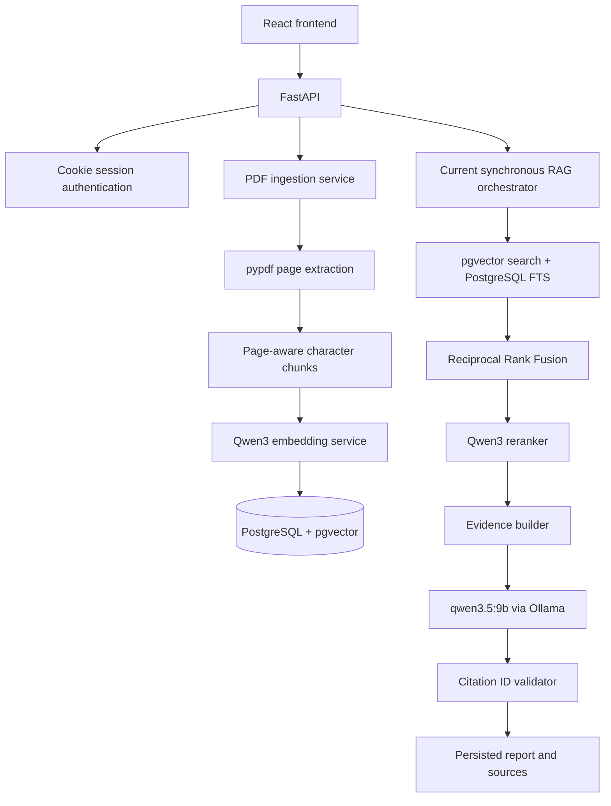
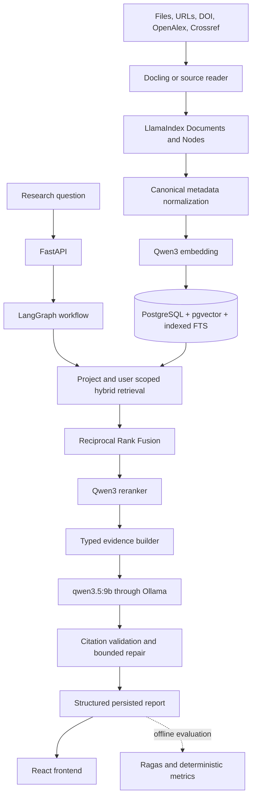

# Advanced RAG Implementation Status

Last updated: 2026-10-01  
Working branch: `feature/advanced-rag-upgrade`

This document is the handoff record for the advanced research assistant upgrade.
It describes the repository as implemented and must be updated when a phase
changes the architecture, database, API, model configuration, or test status.

## Current architecture

The application is a React/Vite frontend backed by a single FastAPI service.
FastAPI owns authentication, document APIs, research APIs, report APIs, and the
current synchronous RAG request. SQLAlchemy and Alembic manage SQLite for unit
tests and PostgreSQL with pgvector for real indexing and retrieval.

### Existing request flow

1. An authenticated user uploads a PDF.
2. The file is validated and stored under `backend/data/uploads`.
3. `pypdf` extracts text and basic metadata page by page.
4. Text is normalized and split with configurable character overlap.
5. `Qwen/Qwen3-Embedding-0.6B` creates normalized 1024-dimensional vectors.
6. Document metadata, chunks, and embeddings are stored in PostgreSQL.
7. A research query performs user-scoped vector and full-text searches.
8. Reciprocal Rank Fusion combines the two ranked result sets.
9. `Qwen/Qwen3-Reranker-0.6B` orders the candidates.
10. The evidence builder selects up to the configured context limit.
11. An evidence threshold either returns the fixed insufficient-evidence answer
    or sends the selected evidence to `qwen3.5:9b` through Ollama.
12. Unknown citation IDs are removed and known IDs are mapped back to stored
    evidence metadata.
13. The research record, report, sections, sources, and citations are saved.

## Target architecture

The upgrade will keep the working services and replace only the responsibilities
that need a stronger implementation.

## Completed components

| Area | Current implementation | Status |
| --- | --- | --- |
| Backend | FastAPI application factory, versioned API, shared error contract and CORS | Complete baseline |
| Authentication | Password accounts, Google OAuth, revocable cookie sessions and ownership checks | Complete baseline |
| Projects | Private user-owned project CRUD, ownership enforcement, search, pagination and soft archiving | Phase 1 foundation complete |
| Database | SQLAlchemy 2, Alembic, PostgreSQL support and SQLite test support | Complete baseline |
| pgvector | Migration-managed `vector` extension, `VECTOR(1024)` column and cosine HNSW index | Complete baseline |
| Upload security | Filename validation, MIME/extension validation, PDF signature check and upload size limit | Complete for PDF |
| PDF extraction | Page-aware text and explicit PDF metadata through `pypdf` | Working baseline |
| Chunking | Conservative normalization, page preservation, heading detection and configurable overlap | Working baseline |
| Embeddings | Lazy, cached Qwen3 embedding model with batching, normalized vectors and device selection | Working baseline |
| Retrieval | User-scoped pgvector cosine search plus PostgreSQL full-text search | Working baseline |
| Fusion | Stable Reciprocal Rank Fusion and chunk-ID deduplication | Complete baseline |
| Reranking | Cached Qwen3 CrossEncoder wrapper with stable ordering and explicit errors | Working baseline |
| Evidence | Stable request-local source IDs, deduplication and configurable evidence limit | Working baseline |
| Generation | Local Ollama-only generation, required-model check, timeout handling and grounded prompt | Working baseline |
| Citations | Removes fabricated citation IDs and builds citation metadata from supplied evidence | Partial |
| Reports | Atomic report, section, source and citation persistence with user-owned reads | Complete baseline |
| Frontend | Real auth, upload, research, progress and report API integration | Working baseline |
| Supabase | TLS connection verified, pgvector enabled and migrations applied through revision 0009 | Verified locally |

## Missing components

### Data and ingestion

- A research project/workspace entity and private CRUD API now exist, but
  documents and research runs are not linked to projects yet. Documents still
  belong to a user globally, and a `Research` row still represents a
  question/run rather than a reusable project.
- Only PDF uploads are accepted. DOCX, PPTX, XLSX, CSV, Markdown, HTML, TXT,
  DOI, OpenAlex, Crossref and URL ingestion are not implemented.
- Docling and LlamaIndex are not dependencies and no Document/Node ingestion
  abstraction exists.
- Chunking is still character-based and cannot preserve tables or rich layout.
- Checksums, duplicate detection, canonical source metadata, content level, and
  metadata provenance are absent.
- OpenAlex and Crossref integrations do not exist.
- URL ingestion and its required SSRF controls do not exist.

### Retrieval and evidence

- Retrieval is user-scoped but cannot yet be project-scoped.
- Full-text search computes `to_tsvector` at query time and has no stored or
  expression GIN index.
- Candidate objects preserve the main scores but lack node IDs, source type,
  source URL, content level, metadata, final rank and project identity.
- Metadata filters for project, document, source type, year, author and DOI are
  not available.
- Evidence sufficiency uses count and one reranker threshold; it has not been
  calibrated against an evaluation dataset.

### Workflow and generation

- The RAG flow is a synchronous function in `services/rag.py`; LangGraph state,
  nodes, conditional routing, checkpointing, retries and repair do not exist.
- Generation returns free-form text rather than a strict structured Pydantic
  result.
- Citation validation checks citation existence but does not yet detect uncited
  claims, verify ownership against the database, or run a bounded repair path.
- Reports do not store a workflow/run ID, prompt/pipeline version, model bundle,
  timings, limitations, or evidence status.

### Evaluation, health and operations

- Ragas and the evaluation package/dataset/runner are not implemented.
- There are no deterministic citation coverage, retrieval quality, or latency
  reports.
- The health endpoint reports only application status and does not independently
  inspect PostgreSQL, pgvector, Ollama, or configured models.
- Logging is conventional Python logging; request/workflow correlation and
  per-stage timings are not implemented.
- `docs/LOCAL_AI_SETUP.md` and `docs/VIVA_ARCHITECTURE.md` do not exist.

### Frontend

- Suggested questions remain static content in `frontend/src/data/mockResearch.ts`.
  They do not fake research results but should eventually be moved to deliberate
  product content or replaced by project-aware suggestions.
- The UI has no project selector, multi-source ingestion, URL/DOI input, content
  level labels, workflow details, or explicit limitations/evidence-status view.

## Migration decisions

1. Preserve the custom PostgreSQL retrieval, RRF, reranking, evidence and
   citation services. Frameworks will wrap or call these services rather than
   replace them.
2. Add a first-class research project model. Existing user-owned documents and
   research rows will require a backward-compatible migration path before
   project scoping becomes mandatory.
3. Introduce canonical source and node metadata incrementally through Alembic.
   Existing `documents` and `document_chunks` tables will be extended rather
   than duplicated.
4. Add Docling and LlamaIndex behind a document-ingestion boundary. Existing
   PDF behavior remains available until equivalent metadata and page fidelity
   are verified with fixtures.
5. Introduce LangGraph only after the underlying ingestion, retrieval, evidence,
   and model services have stable typed contracts.
6. Run Ragas offline. Production research requests will not call an evaluation
   LLM.
7. Keep the application local-first and do not add Redis, Celery, Kafka,
   external vector databases, or paid production LLMs in this phase.

## Database changes

Current migration head: `0010_research_projects`.

Planned migration sequence:

1. `0010_research_projects` adds private workspaces with user ownership,
   timestamps, archiving and supporting indexes.
2. Add nullable project relationships to existing documents and research runs,
   backfill safely, then enforce ownership rules at the service/API layer.
3. Extend documents with source type/URI, checksum, canonical metadata,
   provenance, content level, parser and ingestion version fields.
4. Extend chunks with project ID, node ID, page ranges, section path, token
   count and metadata JSON.
5. Add an indexed PostgreSQL full-text representation using GIN without
   removing the existing vector index.
6. Add workflow/run and evaluation persistence only when their domain contracts
   are implemented.

No destructive schema recreation is planned.

## API changes

Existing `/api/v1/auth`, `/api/v1/documents`, and `/api/v1/research` contracts
remain compatible. `/api/v1/projects` now provides authenticated create, list,
get, update and archive operations with ownership enforced in every lookup.

Planned additions are conceptually:

- create/list/get/update/archive research projects;
- project-scoped file, URL and DOI source ingestion;
- project-scoped source listing and filtering;
- project-scoped research execution;
- richer research/report responses with evidence status, limitations, content
  level, workflow metadata and traceable evidence excerpts;
- lightweight AI readiness plus explicit model warm-up/status behavior.

The exact paths will follow existing route naming and camelCase response rules.

## Environment variables

Already available:

- database connection or individual `SUPABASE_DB_*` settings;
- upload directory and size limit;
- chunk size and overlap;
- Qwen embedding model, dimension, device and batch size;
- vector, keyword and fused candidate limits;
- Qwen reranker model, batch size, evidence count and threshold;
- Ollama URL, qwen generation model, output limit, temperature and timeout;
- authentication, Google OAuth, frontend URL and CORS settings.

Still required as features land:

- maximum retrieval rewrites and citation repairs;
- generation context limit;
- URL fetch timeout, redirect limit and maximum bytes;
- parser/OCR mode and ingestion version;
- default rerank top-K separated from evidence top-K;
- LangGraph checkpoint configuration;
- evaluation adapter and output configuration.

## Model requirements

| Purpose | Required model | Runtime | Current code |
| --- | --- | --- | --- |
| Embedding | `Qwen/Qwen3-Embedding-0.6B` | SentenceTransformers/PyTorch | Implemented |
| Reranking | `Qwen/Qwen3-Reranker-0.6B` | SentenceTransformers CrossEncoder | Implemented |
| Generation | `qwen3.5:9b` | Ollama HTTP API | Implemented |

Models are lazily loaded or externally hosted by Ollama. Ordinary unit tests use
fakes and do not download model weights.

## Testing status

Baseline recorded on 2026-10-01:

| Check | Result |
| --- | --- |
| Backend pytest | 100 passed; 2 dependency deprecation warnings |
| Frontend Vitest | 9 passed across 3 files |
| Frontend TypeScript | Passed |
| Frontend ESLint | Passed |
| Frontend production build | Passed |
| PostgreSQL connection | Verified against configured Supabase project |
| pgvector extension | Installed and verified |
| Alembic | Clean SQLite upgrade verified through `0010_research_projects`; configured PostgreSQL remains at 0009 until deployment |

The current test suite uses SQLite for ordinary backend tests. Dedicated
PostgreSQL integration tests for vector search, FTS indexes and project
isolation still need to be added.

## Known limitations

- Upload processing and research execution are synchronous and can hold an API
  request while local models run.
- PDF extraction cannot handle scanned documents, complex layouts or tables as
  reliably as the target Docling pipeline.
- The current report renderer displays generated Markdown markers as plain text.
- Existing documents are stored on local disk even when metadata lives in
  Supabase; remote object storage is not part of this phase.
- SQLite is intentionally unable to execute the real embedding/retrieval path.
- The current branch is based on `fix/google-oauth-env`, whose Supabase changes
  are under pull request review and are not yet on `main`.

## Next steps

### Phase 1 — database and schemas

1. Link documents and research runs to owned projects with a backward-compatible
   migration and API fields.
2. Make ingestion and retrieval accept an owned project and enforce combined
   user/project isolation in SQL.
3. Add canonical source/content enums and metadata fields without breaking the
   current document API.
4. Add and test a PostgreSQL GIN full-text index.

### Later phases

After Phase 1 is green: harden Qwen health/status behavior; integrate Docling
and LlamaIndex ingestion; extend hybrid retrieval and evidence contracts;
introduce structured generation and citation repair; replace only RAG
orchestration with LangGraph; then add frontend wiring, Ragas evaluation,
security hardening and final documentation.
