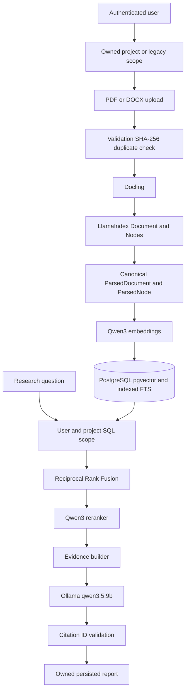

# Advanced Project-Scoped RAG Foundation

## Problem

The original RAG path treated a user's documents as one global collection and
used basic PDF extraction and character chunks. It lacked reusable project
workspaces, rich document structure, indexed PostgreSQL full-text search, and
stable metadata contracts between ingestion, retrieval, evidence, and reports.

## What this PR changes

- Adds private, soft-archived `ResearchProject` workspaces.
- Adds nullable project relationships for documents and research runs while
  retaining legacy null-project records.
- Adds trigger-maintained PostgreSQL `tsvector` data and a GIN index alongside
  the existing pgvector HNSW index.
- Makes Docling the default PDF/DOCX parser and uses LlamaIndex Documents,
  `DoclingNodeParser`, and `HybridChunker` for node standardization.
- Adds canonical source/content metadata, stable node IDs, page ranges,
  sections, tables, captions, checksums, parser identity, and ingestion
  versions.
- Scopes both vector and full-text retrieval by user and exact project in SQL
  before RRF and reranking.

## Why the architecture changed

Research work needs isolation between topics and traceable evidence that
survives every pipeline stage. Docling supplies document structure, LlamaIndex
supplies interoperable Document/Node contracts, and the existing custom
PostgreSQL retrieval remains responsible for vector search, FTS, RRF, and Qwen
reranking. This avoids a second vector store or competing retrieval path.

## Architecture



## Major commits

- `843f97b` — private research project/workspace foundation.
- `8feff9f` — project-scoped documents, research, vector retrieval, and FTS.
- `92f92cb` — Docling and LlamaIndex ingestion foundation.
- Final hardening commit — removes the separately developed Phase 3 slice from
  this feature-frozen PR, fixes contract gaps, and updates review documents.

## Database migrations

- `0010_research_projects`: owned project table and supporting indexes.
- `0011_project_scope_and_fts`: nullable project foreign keys plus PostgreSQL
  `tsvector`, update trigger, and GIN index.
- `0012_canonical_document_metadata`: canonical document/source metadata,
  checksum lookup, stable node identity, page ranges, section paths, token
  counts, and node metadata.

Migration checks cover a fresh database, 0010 to head, 0011 to 0012, and an
0012 downgrade/upgrade round trip. Migrations contain no application imports.

## Security and ownership changes

- Every project lookup combines project ID with authenticated user ID.
- Archived and foreign projects reject uploads and research.
- Document duplicate identity is user + exact project + SHA-256.
- Project vector and FTS filters execute in SQL before top-K ranking.
- Research, progress, and report reads validate parent research ownership.
- Upload validation covers extension/MIME agreement, PDF signature, DOCX ZIP
  traversal, encrypted entries, macros, member count, and expanded size.

## Document ingestion

PDF and DOCX use the Docling/LlamaIndex pipeline by default. HybridChunker uses
the Qwen embedding tokenizer and a configured token limit. Parsed nodes retain
stable IDs, nullable page ranges, section paths, table/caption metadata, parser
identity, and ingestion version. The pypdf path is PDF-only, explicitly
configured, and emits a warning when selected.

Documents move through uploaded, processing, indexed, or failed states. Failed
parsing/embedding clears partial chunks and never leaves them searchable.

## Retrieval

The existing custom architecture remains:

```text
pgvector cosine search + indexed PostgreSQL FTS
→ Reciprocal Rank Fusion
→ Qwen3 reranker
→ bounded evidence
→ local Ollama generation
```

LlamaIndex does not own persistence or retrieval.

## Backward compatibility

Null-project legacy records are preserved. Compatibility research without a
project searches all documents owned by the user. Project research uses an
exact project filter and excludes null-project and other-project records.
Existing API routes remain available; project-scoped upload/list routes are
additive.

## Testing

- Backend: 115 passed, 2 skipped, 0 failed.
- Frontend: 9 passed across 3 files.
- TypeScript, ESLint, frontend production build, Python compilation, dependency
  validation, and `git diff --check`: passed.
- Real opt-in Docling PDF: passed separately.
- PostgreSQL integration: skipped because no dedicated disposable
  `POSTGRES_TEST_DATABASE_URL` was configured; shared Supabase was not used.

## Known limitations

- Ingestion and research are synchronous.
- Files remain on local disk.
- Simultaneous identical uploads are guarded at service level rather than by a
  null-safe database uniqueness constraint.
- Citation validation allowlists emitted IDs but does not yet prove claim
  coverage or semantic entailment.
- The current frontend has no project selector even though project APIs and
  contracts exist.

## Deferred to next PR

- PPTX, HTML, Markdown, and spreadsheet ingestion.
- Secure URL ingestion.
- DOI normalization, Crossref, and OpenAlex.
- Advanced metadata retrieval filters.
- Strict structured Pydantic generation.
- Citation coverage/ownership validation and bounded repair.
- LangGraph, Ragas, Redis, Celery, and background processing.

## Reviewer notes

- Review the three migrations in order; 0012 is the expected head.
- Inspect SQL scoping in both retrieval branches before RRF.
- The Phase 3 multi-source commit remains visible in history but is fully
  reverted by the final hardening commit so it is absent from the PR result.
- Use only a disposable PostgreSQL database whose name contains `test` for the
  destructive integration suite.
